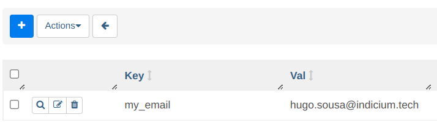

# Desafio Airflow - Atividade Prática | Módulo V

## O Problema
[Desafio Airflow](desafio-airflow.md).

## Como rodar? 

- Obs: os comandos a seguir são destinados para ambientes Linux. 

- Para rodar pela primeira vez, faça o clone do projeto: 
    ```console
    git clone https://github.com/hugosousa111/desafio_airflow.git
    ```
- Na pasta raiz do projeto, crie e ative um ambiente virtual: 
    ```console
    python3 -m venv venv
    source venv/bin/activate
    ```
- Crie um arquivo .env na pasta raiz do projeto, seguindo o arquivo [`.env.example`](.env.example).
- Execute o comando: 
    ```console
    source .env
    ```
- Instale os pacotes necessários com: 
    ```console
    pip install -r requirements.txt
    ```
- E finalmente, chame o airflow (Quando quiser rodar o mesmo projeto novamente, basta fazer este passo): 
    ```console
    airflow standalone
    ```
- No navegador, acesse [localhost:8080](http://localhost:8080/)
- Para não aparecer as Dags de exemplos na home do Airflow, você pode acessar o arquivo `airflow.cfg` e colocar False na variável load_examples:
    ```python
    load_examples = False
    ```
- Adicione a variável my_email no ambiente do Airflow. 
    - Acesse Admin/Variables
    - Clique no botão + para adicionar variável
    - No campo Key coloque 'my_email'
    - No campo Val adicione o email



- Espere a Dag aparecer (Você pode derrubar e subir novamente o airflow se estiver com pressa)
- Acesse a Dag 'DesafioAirflow'
- Ative a Dag, espere a execução da Dag
- O arquivo `logs/simple_log.log` foi criado para facilitar o desenvolvimento da Dag, identificando se os 2 métodos desenvolvidos estavam executando corretamente. Para logs mais completos acesse os logs das task na pasta `logs/` ou na interface do Airflow.